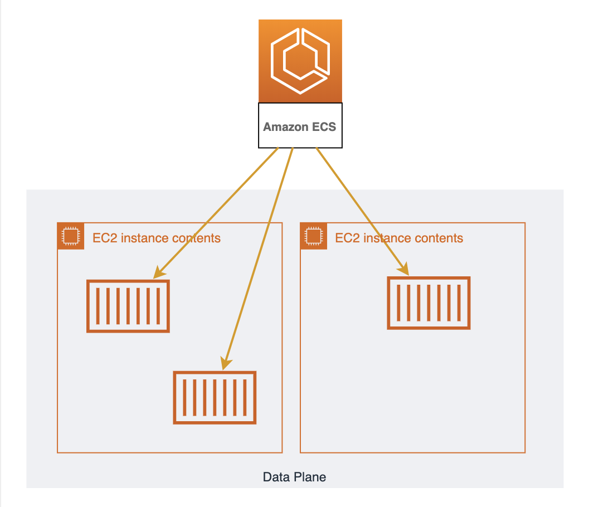
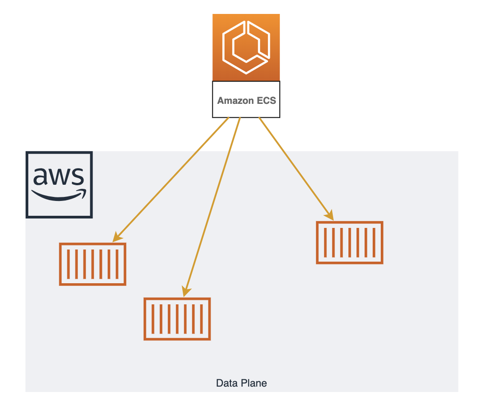

# コンテナ
## コンテナとは

## コンテナ化
### コンテナの活用
本アーキテクチャではDockerを活用します。  
ローカル環境ではdocker-composeを使用し、プロダクション環境ではECS/Fargateを利用します。  

Kubernetes、サーバーレス（LambdaのようなSaaS/FaaS）、PaaS（HerokuやGAE）などではなくECS/Fargateを選択します。  
理由は複数ありますが、大きく「学習コストが低い」「運用コストが低い」ことの2つです。  
コンテナは従来の資産を使用することが可能で、コンテナ化は難しくはないです。ですが、サーバーレスなアーキテクチャはベンダーのレールに乗る必要があり、新しくそのコストを払う必要があります。  
また、ECS/Fargateは他の技術より学習コストが低く、ローカルで動かしたDockerをプロダクションでもすんなり動かすことができ、ECS/Fargate自体が比較的枯れてきている技術でドキュメントも多く、公開されているロードマップ的にもこれからのメインストリームを走るであろうことが伺えます。  
> [aws/containers-roadmap](https://github.com/aws/containers-roadmap/projects/1)

### Dockerとは

コンテナと呼ばれる仮想化のための技術の技術です。  
極端にいうと「誰の/どの環境でも動く」ことがメリットです。  
各環境のバージョンやミドルウェアに振り回されることなく動かすことができます。

詳細は以下のハンズオン資料を参照してください。

> [入門 Docker](https://y-ohgi.github.io/introduction-docker/)

## docker-composeとは

Dockerをローカルで動かすためのツールです。  
往々にして開発は複数のDockerを使用することが多いでしょう。例えば各ランタイムとデータストアの2種類です。  
また、マイクロサービス化によってサービスが別れてきたときに起動方法を `docker-compose up` で統一できることも嬉しいです。

## ECS/Fargateとは

**"Elastic Container Service"** はAWSが開発したDockerオーケストレーションツールです。  
開発者はコンテナを動かすことに集中できるよう開発されていてクラスターの管理はAWSが行ってくれます。  
そのため、プロダクションで活用するまでの学習コストが低く、他のAWSサービスとの連携もしやすいことが特徴です。

### ECSの構成

ECSは **"コントロールプレーン"** と **"データプレーン"** の2つに別れます。  

データプレーンは1台以上のEC2をリソースプールとして扱うもので、データプレーン上にコンテナは配置されます。  
コントロールプレーンはデータプレーン上へコンテナの配置とその管理を行います。  

基本的に開発者はEC2を立てて、ECSのコンソール上で「どんなコンテナが必要か」定義するだけであとはよしなにコンテナが動きます。  

### Fargateとは
データプレーンを構成するEC2郡は開発者が管理する必要があります。  
OS/ライブラリのアップデート/セキュリティパッチや使わなくなったファイルのローテート、リソースが足りなくなった際にスケールさせるなどを行う必要があります。  

Fargateは **"データプレーンの第二の選択肢"**です。  

コンテナを動かすリソースプールとして、開発者が管理するEC2郡ではなくAWSがマネージするリソースプールを使用します。  
これによりEC2の管理から手離れができ学習コスト/運用コストが低くなります。反面、EC2をうまく使った時より利用料は高くなります。  

基本的にAWSに不慣れな場合はデータプレーンにEC2ではなくFargateを選択したほうが最終的にコストパフォーマンスが良いでしょう。  

!!! note "Kubernetesではない理由"
    不慣れなうちはKubernetesはやめましょう。  
    Kubernetesはモダンかつ良い技術です。今後主流になっていくのは確実でしょう。  
    しかし、学習コストと運用コストが高く、積極的に取り入れていく体制が整っていないと継続して開発/運用していくのは厳しいです。  
    また、作ったあと塩漬けにすることはできません。例えば大手クラウドベンダーのマネージドKubernetesはバージョンアップを行わなければならない仕組みがあります。  
    事前にKubernetesの事を学習し、コストを支払うことがチーム内で合意できた場合にのみ使用しましょう。  
    界隈によっては「Kubernetesクラスター管理専任のエンジニアが3人ほしい」と言わています。  
    きちんとECS/Fargateで動作するよう設計/開発していればKubernetesにスムーズに移行することが可能です。コンテナやクラウドに不慣れなうちはKubernetesはやめて、ECS/Fargateで運用が安定してからKubernetesへ移行しましょう。
