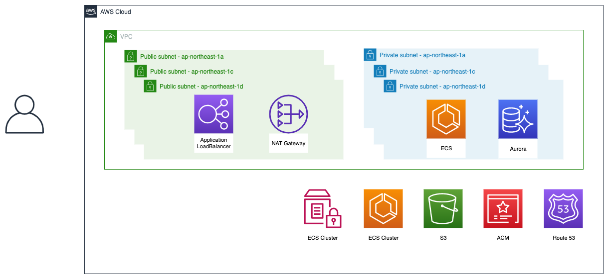

## 想定されるリポジトリ

- [y-ohgi/starterkit-inf](https://github.com/y-ohgi/starterkit-inf)
    - TerraformでAWSの共通リソース（VPC, ALB, ECS Cluster, etc...）を記載
- [y-ohgi/starterkit-app](https://github.com/y-ohgi/starterkit-app)
    - アプリケーションコード用リポジトリ
    - ローカル環境ではdocker-composeを、本番環境では"starterkit-inf"で構築した共通リソースの上にECS/Fargateを構築します。
        - サンプルとして別ブランチにgolangでの例を用意しています。
    - "starterkit-app"は"_infra"ディレクトリに配置されているTerraformがメインになります。リポジトリルートに任意のファイル・ディレクトリ（RailsやNextなど）を配置し、"_infra"ディレクトリをコピペして使用することを想定しています。

この2リポジトリをcloneし、README通りに構築すると以下の通り構築されます。

## 本番で想定される使い方
"starterkit-inf"はOgranization配下にForkしてもらい、"starterkit-app"は"_infra"ディレクトリだけコピペすると良いでしょう。  
近年のサービスは"api"や"front"など複数のサービス（リポジトリ）からなることがあるでしょう。スターターキットでは複数のサービスが構築されることを想定しています。そのため、共通リソースだけを"starterkit-inf"に切り出し、サービス側は"starterkit-inf"が生成したリソースを参照する形になっています。

## プロビジョニング/デプロイ
"starterkit-inf"は更新頻度が少ないですが、"starterkit-app"側は変更頻度が高いでしょう。  
struct_architecture.png今回は"starterkit-app"ではCircleCIを使用して、タグが付いたタイミングでデプロするよう構築しています
